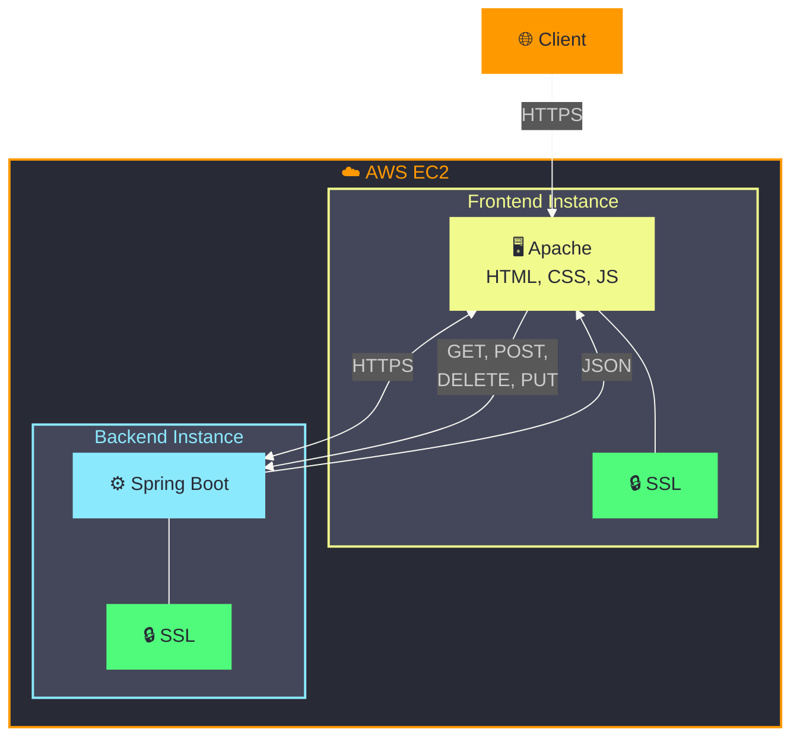
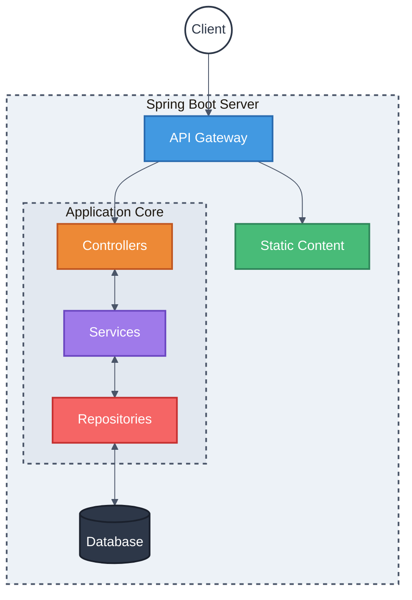

# AREP-AplicacionSeguridadLAB06
## Taller: Security Application Design
Integración de un sistema de inicio de sesión y registro a la aplicación web de registro de entregas anteriormente desarrollada en Spring-Boot. Además cuenta con despliegue en AWS por medio de dos instancias, 
una con un servidor web apache para alojar la página .html, los archivos js y los estilos css. Esta página realizará las peticiones a otra instancia en la cual estará corriendo la lógica. Estas peticiones se 
realizan por medio de conexión segura por medio de TLS.

## Instalación y Ejecución
Las siguientes instrucciones son para ejecutar el proyecto de forma local. El primer paso es instalar java, git y maven en su equipo con las siguientes versiones:

* Apache Maven 3.9.6

* Java 17
 
después de esto clonar el repositorio desde la terminal de la siguiente manera:

```
git clone https://github.com/Knight072/AREP-AplicacionSeguridadLAB6
```

* Para compilar el proyecto

```
mvn clean install
```

* Finalmente para ejecutar la aplicación

```
java -jar target/AREP-AplicacionSeguridadLAB6-1.0-SNAPSHOT.jar
```

Por último, se ingresa desde un Browser a la dirección http://localhost:8080 para interactuar con la aplicación web.


Primero registramos un usuario, por medio de un usuario y contraseña.


Si se registra de nuevo con el mismo usuario ocurrirá una excepción.


Se guardará la contraseña de forma encriptada usando el algoritmo SHA-256.
Ahora se puede logear con la cuenta registrada anteriormente y se redireccionara al apartado para gestión de entregas.


### Despliegue

El despliegue se hace en AWS EC2, donde hay dos instancias con apache instalado. Una de las instancias aloja los archivos del cliente(html, css y js). La otra instacia 
ejecuta spring-boot con todo el backend de la aplicación, incluyendo una base de datos en H2. Para cada instancia se configuró un certificado SSL por medio de la 
aplicación [Certbot (eff.org)](https://certbot.eff.org/) para habilitar el ingreso seguro por medio de https.
Video del despliegue en funcionamiento: https://youtu.be/fKNLOPu5Kbs



## Arquitectura

-   **Cliente (Vista)**: El cliente envía solicitudes desde una interfaz basada en HTML, CSS y JavaScript. Estas solicitudes pueden ser `GET`, `POST`, `PUT` o `DELETE` para gestionar.
    La comunicación entre el cliente y el servidor se realiza a través de `HTTPS`.
    
-   **Controlador**:
    
    -   `DeliveryController` maneja las solicitudes relacionadas con las entregas. Recibe los datos de entrada, llama al servicio adecuado y devuelve las respuestas correspondientes,
        en formato JSON. Se obtiene todas las entregass, crear nuevas entregass, actualizar los datos de entregas existentes y eliminar entregas.
    -   `UserLoginController` gestiona la autenticidad de los usuarios. Se recibe las solicitudes de inicio de sesión y registro, valida las credenciales y devuelve el estado
        correspondiente, la aceptación de las credenciales o su negación.
      
-   **Servicio (Service)**:
    
    -   `DeliveryService`. Procesa los datos, maneja las reglas de negocio y delega las operaciones CRUD al repositorio. Las funciones en esta clase incluyen la
        obtención, la creación, la actualización y la eliminación de entregas.
    -   `UserService` maneja la lógica relacionada con la autenticación y gestión de usuarios. Valida las credenciales de los usuarios durante el inicio de sesión y de crear
        nuevos usuarios, asegurando que las contraseñas sean seguras mediante hashing.
        
-   **Repositorio (Repository)**:
    
    -   `DeliveryRepository` es la interfaz que conecta la aplicación con la base de datos, realizando las operaciones de creación, lectura, actualización y eliminación (CRUD)
        para las entregas. Esta interfaz utiliza Spring Data JPA para interactuar con la base de datos.
    -   `UserRepository` se encarga de las operaciones relacionadas con los usuarios, permitiendo encontrar usuarios por nombre de usuario y realizar operaciones CRUD sobre ellos.
      
-   **Base de Datos**: El repositorio interactúa con la base de datos para almacenar y recuperar la información de las entregas y usuarios. Se ha utilizado H2 como base de datos
      en memoria para facilitar el desarrollo y las pruebas.



## Test

Para ejecutar las pruebas ejecute el comando:

```
mvn test
```


## Build With

- [Spring Boot 3.3.4](https://spring.io/projects/spring-boot) - Framework para el back-end

- [Java](https://www.java.com/) - Lenguaje de programación principal

- [Maven](https://maven.apache.org/) - Gestión de dependencias y automatización de compilación
- [The Apache HTTP Server Project](https://httpd.apache.org/) - Servidor web 

- [HTML5](https://developer.mozilla.org/es/docs/Web/HTML) - Lenguaje de marcado para la estructura y el contenido

- [CSS3](https://developer.mozilla.org/es/docs/Web/CSS) - Estilos

- [JavaScript](https://developer.mozilla.org/es/docs/Web/JavaScript) - Scripting del lado del cliente

- [H2 Database Engine](https://www.h2database.com/html/main.html)  - Base de datos

- [Bootstrap](https://getbootstrap.com/) - Framework CSS para diseño responsivo
  

## Versionado

Version: 1.0

## Author

* **Daniel Felipe Rojas Hernández** - [Knight072](https://github.com/Knight072)

## Licencia

Este proyecto está bajo la Licencia MIT. Ver el archivo [LICENSE](LICENSE) para más detalles.
